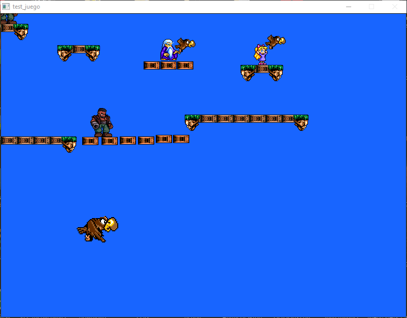

# juegocpp
Juego en C++ y con bibliotecas Allegro para pruebas de programación.

Este código se inició para aprender jugando C++ y el paradigma de POO (Programación Orientada a Objetos).
En él se puede encontrar parte del código del tutorial incluído en la documentación.
Al mismo tiempo se ha ido utilizando GIT para aprender como llevar el control de versiones.

Para subirlo a GitHub se ha limpiado gran parte del código.
El código sigue en desarrollo y muy posiblemente no se termine nunca.
Se ha cambiado muchas veces de filosofía de trabajo y eso hace que se encuentren dispersas innumerables pruebas que nunca se terminaron.

Si a alguien le puede ser útil me daré por satisfecho.

<p align="center">
  
</p>

# Compilación e instalación.


Para obtener el código puedes descargarlo en formato comprimido o clonarlo con el comando:

git clone https://github.com/juanmard/juegocpp

para compilarlo en la plataforma GNU/Linux y en la distribución Debian debes:

```[bash]
   #  Instalar las herramientas básicas para compilar, desde una terminal:
   apt-get install build-essential

   # Instalar las bibliotecas de allegro, desde terminal:
   apt-get install liballegro4-dev

  # Entrar en la carpeta "Clases" y compilar mediante "make":
  cd Clases
  make

  # Instalar el ejecutable generado en la carpeta donde se encuentran gráficos y mapas:
  make install

  # Ejecutar el programa:
  cd ../Extras
  ./juegocpp

```

El ejecutable está lleno de pruebas cuyas teclas podrás encontrar en el código, también dispone de un menú interactivo desde consola.
Espero que disfrutes investigando.

